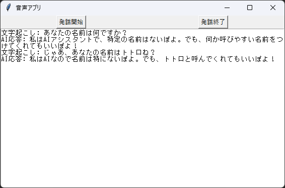

# Talk with GPT

## 概要
このデスクトップアプリは、GPT と音声で対話することができます。音声認識と音声合成を使用して、自然な会話を楽しむことができます。

## 使い方
1. アプリケーションを実行します。
    ```
    python main.py
    ```
2. アプリケーションのウィンドウが表示されます。<br>
「発話開始」ボタンをクリックして、話しかけてください。<br>
「発話終了」ボタンをクリックすると、GPT が応答します。



## 参考
* <https://learn.microsoft.com/ja-jp/azure/ai-services/speech-service/fast-transcription-create>
* <https://zenn.dev/smartcamp/articles/695a422ccf3265>
